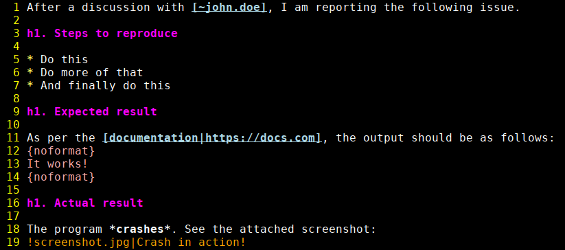

# Vim syntax highlighting for Jira issues

A Vim syntax-highlighting file for issues in the [Jira](https://www.atlassian.com/software/jira) issue-tracking system. Based on the [official text-formatting help page](https://jira.atlassian.com/secure/WikiRendererHelpAction.jspa?section=all).



Note: Some highlighting rules are simplified or might be missing. Feel free to contribute by opening an issue or a pull request.

## Installation

The installation depends on the plugin manager you use (if any). Here are some of the options:

### vim-pathogen

If you use [vim-pathogen](https://github.com/tpope/vim-pathogen), go into the `bundle` directory and clone the repository in there:
```bash
cd ~/.vim/bundle
git clone https://github.com/s3rvac/vim-syntax-jira.git
```

### lazy.nvim

If you use [lazy.nvim](https://github.com/folke/lazy.nvim), add the following piece of code into your plugin configuration:
```lua
-- Vim syntax highlighting for Jira issues
-- https://github.com/s3rvac/vim-syntax-jira
{
    "s3rvac/vim-syntax-jira",
}
```

### Manual installation

You can also install the plugin manually by copying the [`syntax/jira.vim`](https://raw.githubusercontent.com/s3rvac/vim-syntax-jira/master/syntax/jira.vim) file to your `~/.vim/syntax` directory.

## Usage

I use the [Firefox](https://www.mozilla.org/en-US/firefox/) web browser together with the [textern](https://github.com/jlebon/textern) extension to write and edit Jira issues in Vim. To automatically apply the syntax highlighting upon editing an issue, I use the following configuration (you will need to replace `jira.mycompany.com` with the URL of your Jira instance):
```vim
let s:opened_file_path = expand('%:p')
if s:opened_file_path =~ 'textern-.*jira.mycompany.com'
    augroup firefox_textern_plugin
    autocmd!
    " Enable Jira syntax highlighting.
    autocmd BufRead,BufNewFile *.txt setl ft=jira
    " (Optional) Enable English spell checking.
    autocmd BufRead,BufNewFile *.txt setl spell spelllang=en
    augroup end
endif
```

If you want to edit descriptions of Jira issues in Vim, check out [this blog post](https://blog.petrzemek.net/2024/03/03/editing-descriptions-of-jira-issues-in-vim/).

## Development

Use the [test/test.jira](test/test.jira) file to test the syntax highlighting:
```bash
vim +'setl ft=jira' +'source syntax/jira.vim' test/test.jira
```
If you use the syntax file in your Vim configuration and are unable to override it with the local syntax file, disable the syntax file in your Vim configuration while developing the plugin.

## License

Copyright (c) 2024 Petr Zemek (s3rvac@petrzemek.net) and contributors.

Distributed under the MIT license. See the [`LICENSE`](LICENSE) file for more details.
