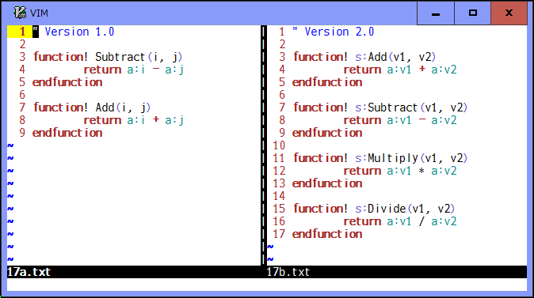
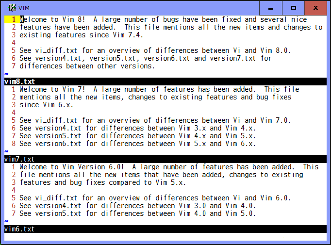

# spotdiff.vim

### A range and area selectable `:diffthis` to compare partially

Vim provides a diff mode which is useful to see differences between windows.
However, it always shows the differences for entire line.  And it can not
compare a sequence of words within a line, and sentences and paragraphs which
are separated into several lines.

To compare partially everywhere in any window, this plugin provides two groups
of commands, which are alternative to vim original `:diffthis`, `:diffoff`,
and `:diffupdate`.  One is for which allows to select a range of lines in diff
mode.  Another is for which allows to select the Visual, motion, and text
object area in non-diff normal mode.  Both work independently in a tab page.

## Selecting a range of lines

There are `:Diffthis`, `:Diffoff`, and `:Diffupdate` commands available.

You can use `:Diffthis` to specify a range of lines to be compared.  And can
use `:Diffoff` to reset and `:Diffupdate` to update the differences.

Do not use vim original diff commands together with this plugin's ones.  Try
`:Diffoff!` to reset all in a trouble.

If you have installed [diffchar.vim](https://github.com/rickhowe/diffchar.vim)
plugin, you can see the exact differences and use their options and keymaps.

#### Commands

* `:[range]Diffthis`
	* Select a range of lines with `[range]` (default: current line) and make
	the current window diff mode.  The selected lines are highlighted in
	`hl-CursorColumn`.  Shortly after the two separate windows become diff
	mode, `:Diffthis` shows the differences for selected lines in each
	window.  It is also possible to select two ranges of lines in the same
	window.  In that case, `:Diffthis` opens a temporary new window above
	or below of the current one, copies selected lines to it, and shows
	the difference with source window.

* `:Diffoff[!]`
	* Clear the selected range of lines and reset diff mode for the current
	window.  If `!` flag is specified, clear and reset for all windows in
	the current tab page.  The temporary window created by `:Diffthis`
	will be closed.

* `:Diffupdate`
	* Update the differences for the selected range of lines in the current
	tab page.

#### Demo

## Selecting the Visual, motion, and text object area

There are `:VDiffthis`, `:VDiffoff`, and `:VDiffupdate` commands available.

You can use `:VDiffthis` to specify the Visual area to be compared.  And can
use `:VDiffoff` to reset and `:VDiffupdate` to update the differences.  Note
that those commands work in non-diff normal mode.

While showing the exact differences, when the cursor is moved on a difference
unit, you can see its corresponding unit highlighted in `hl-Cursor`, according
to the `g:DiffPairVisible` option.

You can use `]b` or `]e` to jump cursor to start or end position of the next
difference unit, and `[b` or `[e` to the start or end position of the previous
unit.

This plugin provides the corresponding mappings to those commands, such as
`<Plug>(VDiffthis)` and `<Plug>(VDiffoff)`.  As a default, `<Leader>t` and `<Leader>o`
keys are mapped to them and, for example, `v$<Leader>t` selects the text from
the current cursor position to the end of line and `3vis<Leader>t` selects the
next 3 sentences as the Visual area.  And `<Leader>o` clears the selected
area.

In addition to selecting the Visual area, you can use `<Leader>t` as a custom
operator followed by a motion or a text object command, which will set those
selected area as the Visual one and then call `:VDiffthis`.  For example,
`<Leader>t$` and `<Leader>t3is` work same as above examples.

#### Commands

* `:[range]VDiffthis[!]`
	* Select the characterwise, linewise, or blockwise Visual area most
	recently used in the current window.  If `[range]` (default: current
	line) is not specified as `'<,'>` and different from the last Visual
	area, those specified lines are selected as linewise area instead.
	The selected area is highlighted in `hl-DiffChange` with "italic", and
	then will be compared as a single combined line.  Shortly after the
	two area are selected, `:VDiffthis` compares them based on the
	`g:DiffUnit` option and "icase", "iwhite", "iwhiteall" and "iwhiteeol"
	flags in the 'diffopt' option.  Then their differences are shown using
	the `g:DiffColors` option.  It is also possible to select two area in
	the same window.  If `!` flag is specified, each line is separately
	compared, which would be useful particular for columns in a table on
	blockwise area.  Redundant lines in the line-by-line comparison are
	shown with "strikethrough".

* `:VDiffoff[!]`
	* Clear the selected area in the current window and reset the
	differences.  When there are two area selected in the same window,
	both area will be cleared.  But either one is cleared if the current
	cursor is located within it.  If `!` flag is specified, clear and reset
	all area in the current tab page.

* `:VDiffupdate`
	* Compare the selected area again and show their differences in the
	current tab page, when you make changes to the selected area or you
	want to change the `g:DiffUnit` or `g:DiffColors` option.

#### Options

These options are same as those used in the [diffchar.vim](https://github.com/rickhowe/diffchar.vim) plugin.

* `g:DiffUnit`, `t:DiffUnit`: A type of difference unit
	* 'Char'  : any single character
	* 'Word1' : `\w\+` word and any `\W` single character (default)
	* 'Word2' : non-space and space words
	* 'Word3' : `\<` or `\>` character class boundaries

* `g:DiffColors`, `t:DiffColors`: Matching colors for changed units
	* 0 : `hl-DiffText` (default)
	* 1 : `hl-DiffText` + up to 3 other highlights
	* 2 : `hl-DiffText` + up to 7 other highlights
	* 3 : `hl-DiffText` + up to 15 other highlights

* `g:DiffPairVisible`, `t:DiffPairVisible`: Visibility of corresponding diff units
	* 0 : disable
	* 1 : highlight with `hl-Cursor` (default)

#### Keymaps

These keymaps are same as those used in the [diffchar.vim](https://github.com/rickhowe/diffchar.vim) plugin.

* `<Plug>JumpDiffCharPrevStart` (default: `[b`)
	* Jump cursor to the start position of the previous difference unit
* `<Plug>JumpDiffCharNextStart` (default: `]b`)
	* Jump cursor to the start position of the next difference unit
* `<Plug>JumpDiffCharPrevEnd` (default: `[e`)
	* Jump cursor to the end position of the previous difference unit
* `<Plug>JumpDiffCharNextEnd` (default: `]e`)
	* Jump cursor to the end position of the next difference unit

These keymaps are used only in this plugin.

* `<Plug>(VDiffthis)` (default: `<Leader>t`)
	* call `:VDiffthis` for the visually selected area
	* set the selected motion and text object area as the Visual one and then call `:VDiffthis` 
* `<Plug>(VDiffthis!)` (default: `<Leader>T`)
	* call `:VDiffthis!` for the visually selected area
	* set the selected motion and text object area as the Visual one and then call `:VDiffthis!` 
* `<Plug>(VDiffoff)` (default: `<Leader>o`)
	* call `:VDiffoff` in the current window
* `<Plug>(VDiffoff!)` (default: `<Leader>O`)
	* call `:VDiffoff!` in the current tab page
* `<Plug>(VDiffupdate)` (default: `<Leader>u`)
	* call `:VDiffupdate` in the current tab page

#### Demo

