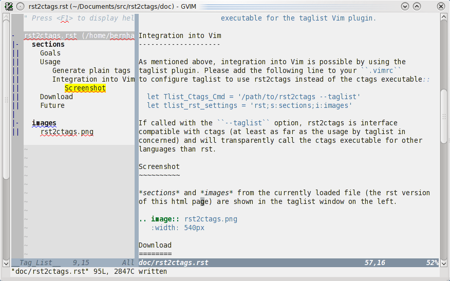

*********
rst2ctags
*********

Goals
=====

rst2ctags was started with two milestones in mind:

1. Generating a *tags* file from one ore more `rst`_ files.

   Instead of adding rst support to ctags in the usual way by writing a
   new language parser in C, I decided to use the available docutils
   Python package for the hard part - the parsing.

2. Integration into `Vim`_ via the `taglist`_ plugin.

Usage
=====

Generate plain tags file
------------------------

The basic command line usage is compatible with `ctags`_::

  rst2ctags [options] [file(s)]

  CTAGS-Specific Options
  ----------------------
  -f <FILE>         Write tags to specified file (default: "tags"). Value
                    of "-" writes tags to stdout.
  -R                Recurse into directories supplied on command line
  --sort=[yes|no]   Should tags be sorted by name? Default is "no", which
                    will sort by line number.
  --taglist         Compatibility mode in order to be used as main ctags
                    executable for the taglist Vim plugin.

Integration into Vim
--------------------

As mentioned above, integration into Vim is possible by using the
taglist plugin. Please add the following line to your ``.vimrc``
to configure taglist to use rst2ctags instead of the ctags executable::

  let Tlist_Ctags_Cmd = '/path/to/rst2ctags --taglist'
  let tlist_rst_settings = 'rst;s:sections;i:images'

If called with the ``--taglist`` option, rst2ctags is interface
compatible with ctags (at least as far as the usage by taglist in
concerned) and will transparently call the ctags executable for other
languages than rst.

Screenshot
~~~~~~~~~~

*sections* and *images* from the currently loaded file (the rst version
of this html page) are shown in the taglist window on the left.

Download
========

The `complete repository
<http://bitbucket.org/bernh/rst2ctags/>`_ is hosted on bitbucket and can
be cloned by::

  hg clone https://bernh@bitbucket.org/bernh/rst2ctags/

Or download the
`lastest version <http://bitbucket.org/bernh/rst2ctags/get/tip.zip>`_.

Future
======

I consider *rst2ctags* feature complete and won't spend much work in
improvments since I don't use vanilla Vim that much any more. Please
have a look at `pida-rst-plugin`_ which can be considered as successor
project.

Anyway, if you have any feature requests or bug reports, please create
`a new issue <http://bitbucket.org/bernh/rst2ctags/issues/>`_.

.. _`Vim`: http://www.vim.org/
.. _`rst`: http://docutils.sourceforge.net/rst.html
.. _`taglist`: http://vim-taglist.sourceforge.net/
.. _`ctags`: http://ctags.sourceforge.net/
.. _`rst2ctags`: http://bernh.net/projects/rst2ctags/
.. _`pida-rst-plugin`: http://bernh.net/projects/pida-rst-plugin/

